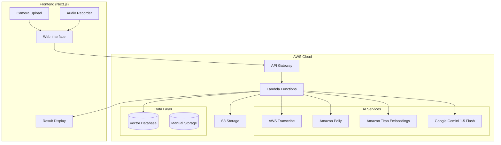
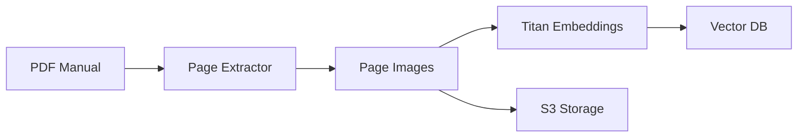
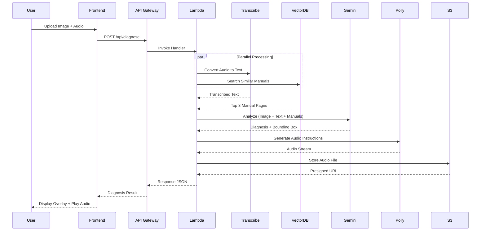

# Design Document: Mistri.AI

## Overview

Mistri.AI is a serverless, multimodal Visual RAG application built on AWS infrastructure that enables semi-skilled technicians in India to diagnose and repair hardware appliances. The system combines computer vision, natural language processing, and retrieval-augmented generation to bridge the gap between complex English technical manuals and vernacular field workers.

The architecture follows a three-pipeline approach:
1. **Data Pipeline**: Offline ingestion of PDF manuals into a vector database
2. **Inference Pipeline**: Real-time diagnosis processing triggered by user requests
3. **Frontend**: Responsive React-based web interface for mobile and desktop

The system is designed for low-latency (<5 seconds), high-availability operation with automatic scaling through AWS Lambda and serverless components.

## Architecture

### High-Level Architecture



### Data Pipeline Architecture



### Inference Pipeline Architecture



## Components and Interfaces

### Frontend Components

#### 1. CameraUpload Component
**Purpose**: Capture or upload images of hardware components

**Interface**:
```typescript
interface CameraUploadProps {
  onImageCapture: (imageBlob: Blob) => void;
  maxSizeMB: number;
  acceptedFormats: string[];
}

interface CameraUploadState {
  preview: string | null;
  error: string | null;
  isCapturing: boolean;
}
```

**Behavior**:
- Provides file input for desktop and camera capture for mobile
- Validates image format (JPEG, PNG, WebP) and size (<10MB)
- Displays preview of captured/uploaded image
- Emits imageBlob to parent component on successful capture

#### 2. AudioRecorder Component
**Purpose**: Record voice descriptions from technicians

**Interface**:
```typescript
interface AudioRecorderProps {
  onRecordingComplete: (audioBlob: Blob) => void;
  maxDurationSeconds: number;
  minDurationSeconds: number;
}

interface AudioRecorderState {
  isRecording: boolean;
  duration: number;
  error: string | null;
}
```

**Behavior**:
- Uses Web Audio API to capture microphone input
- Displays recording indicator and timer
- Validates duration (1-60 seconds)
- Emits audioBlob in format compatible with AWS Transcribe (WebM/Opus or MP3)

#### 3. LanguageSelector Component
**Purpose**: Allow users to select Hindi or English

**Interface**:
```typescript
interface LanguageSelectorProps {
  onLanguageChange: (language: 'hi' | 'en') => void;
  defaultLanguage: 'hi' | 'en';
}

type Language = 'hi' | 'en';
```

**Behavior**:
- Displays language toggle or dropdown
- Persists selection to localStorage
- Updates UI text based on i18n configuration

#### 4. ResultOverlay Component
**Purpose**: Display annotated image with bounding box

**Interface**:
```typescript
interface ResultOverlayProps {
  originalImage: string;
  boundingBox: [number, number, number, number];
  repairText: string;
  audioUrl: string;
  productLink?: ProductLink;
}

interface ProductLink {
  name: string;
  url: string;
  affiliateId: string;
}
```

**Behavior**:
- Renders original image with canvas overlay
- Draws red rectangle at bounding box coordinates
- Displays repair instructions text
- Provides audio playback controls
- Shows "Buy on Amazon" button if product link exists

#### 5. DiagnosisForm Component
**Purpose**: Orchestrate the diagnosis workflow

**Interface**:
```typescript
interface DiagnosisFormProps {
  onSubmit: (request: DiagnosisRequest) => Promise<DiagnosisResponse>;
}

interface DiagnosisRequest {
  image: Blob;
  audio: Blob;
  language: 'hi' | 'en';
}

interface DiagnosisResponse {
  repairText: string;
  audioUrl: string;
  boundingBox: [number, number, number, number];
  productLink?: ProductLink;
  error?: string;
}
```

**Behavior**:
- Collects image, audio, and language inputs
- Validates all inputs before submission
- Calls `/api/diagnose` endpoint
- Handles loading states and errors
- Routes to ResultOverlay on success

### Backend Components

#### 1. DiagnosisHandler (AWS Lambda)
**Purpose**: Main orchestrator for diagnosis requests

**Interface**:
```typescript
interface LambdaEvent {
  body: string; // Base64 encoded multipart form data
  headers: Record<string, string>;
}

interface LambdaResponse {
  statusCode: number;
  body: string; // JSON stringified DiagnosisResponse
  headers: Record<string, string>;
}
```

**Behavior**:
- Parses multipart form data from API Gateway
- Validates image and audio blobs
- Orchestrates parallel calls to Transcribe and VectorSearch
- Calls Gemini for diagnosis
- Calls Polly for TTS
- Stores audio in S3
- Returns formatted response

**Dependencies**:
- TranscribeService
- VectorSearchService
- GeminiService
- PollyService
- S3Service

#### 2. TranscribeService
**Purpose**: Convert audio to text using AWS Transcribe

**Interface**:
```typescript
interface TranscribeService {
  transcribeAudio(
    audioBlob: Buffer,
    languageCode: 'hi-IN' | 'en-IN'
  ): Promise<string>;
}
```

**Behavior**:
- Uploads audio to temporary S3 location
- Starts transcription job with specified language
- Polls for completion (or uses async callback)
- Extracts transcript text from results
- Cleans up temporary S3 objects

#### 3. VectorSearchService
**Purpose**: Search vector database for relevant manual pages

**Interface**:
```typescript
interface VectorSearchService {
  searchSimilarPages(
    imageBlob: Buffer,
    topK: number
  ): Promise<ManualPage[]>;
}

interface ManualPage {
  pageNumber: number;
  manualName: string;
  applianceModel: string;
  imageUrl: string;
  text: string;
  similarityScore: number;
}
```

**Behavior**:
- Generates embedding for query image using Amazon Titan
- Queries vector database with embedding
- Returns top K results with similarity scores above threshold (0.6)
- Fetches associated page images from S3

#### 4. GeminiService
**Purpose**: Perform multimodal analysis and generate diagnosis

**Interface**:
```typescript
interface GeminiService {
  diagnose(
    userImage: Buffer,
    transcribedText: string,
    manualPages: ManualPage[],
    language: 'hi' | 'en'
  ): Promise<DiagnosisResult>;
}

interface DiagnosisResult {
  faultyComponent: string;
  boundingBox: [number, number, number, number];
  repairSteps: string;
  requiresReplacement: boolean;
  componentModelNumber?: string;
}
```

**Behavior**:
- Constructs multimodal prompt with user image, manual pages, and text
- Calls Gemini 1.5 Flash API with structured output request
- Parses response to extract bounding box coordinates
- Validates coordinate format [x1, y1, x2, y2]
- Returns structured diagnosis result

**Prompt Template**:
```
You are an expert appliance repair technician. Analyze the following:

1. User's circuit board image
2. User's problem description: "{transcribedText}"
3. Relevant manual pages: [images]

Tasks:
- Identify the faulty component
- Provide bounding box coordinates [x1, y1, x2, y2] for the component
- Generate step-by-step repair instructions in {language}
- Indicate if component replacement is needed
- If replacement needed, provide component model number

Output format: JSON
```

#### 5. PollyService
**Purpose**: Convert repair text to speech

**Interface**:
```typescript
interface PollyService {
  synthesizeSpeech(
    text: string,
    languageCode: 'hi-IN' | 'en-IN'
  ): Promise<Buffer>;
}
```

**Behavior**:
- Selects appropriate voice for language (Aditi for Hindi, Raveena for English)
- Calls Amazon Polly SynthesizeSpeech API
- Returns audio stream as Buffer
- Uses neural voice engine for natural speech

#### 6. S3Service
**Purpose**: Store and retrieve files from S3

**Interface**:
```typescript
interface S3Service {
  uploadAudio(audioBuffer: Buffer, key: string): Promise<string>;
  generatePresignedUrl(key: string, expiresIn: number): Promise<string>;
  uploadManualPage(imageBuffer: Buffer, key: string): Promise<string>;
}
```

**Behavior**:
- Uploads audio files to designated S3 bucket
- Generates presigned URLs with 24-hour expiration
- Manages manual page storage during ingestion

#### 7. ManualIngestionHandler (AWS Lambda)
**Purpose**: Process PDF manuals and populate vector database

**Interface**:
```typescript
interface IngestionEvent {
  pdfUrl: string;
  manualName: string;
  applianceModel: string;
}

interface IngestionResult {
  pagesProcessed: number;
  errors: string[];
}
```

**Behavior**:
- Downloads PDF from provided URL
- Extracts each page as PNG image using pdf-lib or similar
- Generates embedding for each page using Amazon Titan
- Stores embedding in vector database with metadata
- Uploads page images to S3
- Returns ingestion statistics

### API Endpoints

#### POST /api/diagnose

**Request**:
```
Content-Type: multipart/form-data

Fields:
- image: File (JPEG/PNG/WebP, max 10MB)
- audio: File (WebM/MP3, 1-60 seconds)
- language: string ('hi' | 'en')
```

**Response** (200 OK):
```json
{
  "repairText": "Step 1: Disconnect power...",
  "audioUrl": "https://s3.amazonaws.com/...",
  "boundingBox": [120, 80, 250, 180],
  "productLink": {
    "name": "Washing Machine Motor Capacitor 10uF",
    "url": "https://amazon.in/...",
    "affiliateId": "mistri-21"
  }
}
```

**Response** (400 Bad Request):
```json
{
  "error": "Invalid image format. Accepted formats: JPEG, PNG, WebP"
}
```

**Response** (500 Internal Server Error):
```json
{
  "error": "Diagnosis processing failed. Please try again."
}
```

## Data Models

### Vector Database Schema

**Collection**: `manual_pages`

**Document Structure**:
```typescript
interface VectorDocument {
  id: string; // UUID
  embedding: number[]; // 1024-dimensional vector from Titan
  metadata: {
    pageNumber: number;
    manualName: string;
    applianceModel: string;
    applianceType: string; // 'washing_machine', 'refrigerator', etc.
    imageS3Key: string;
    textContent: string;
    uploadedAt: string; // ISO 8601 timestamp
  };
}
```

**Indexes**:
- Vector similarity index on `embedding` field
- Filter index on `metadata.applianceType`

### S3 Bucket Structure

**Bucket**: `mistri-ai-storage`

**Structure**:
```
/manuals/
  /{appliance_type}/
    /{manual_name}/
      /page_{number}.png

/audio-outputs/
  /{date}/
    /{request_id}.mp3

/temp/
  /{request_id}/
    /input_audio.webm
```

**Lifecycle Policies**:
- `/temp/*`: Delete after 1 day
- `/audio-outputs/*`: Delete after 7 days
- `/manuals/*`: Retain indefinitely

### DynamoDB Schema (Optional - for user authentication)

**Table**: `mistri_users`

**Schema**:
```typescript
interface UserRecord {
  userId: string; // Partition key (UUID)
  email: string; // GSI partition key
  passwordHash: string;
  preferredLanguage: 'hi' | 'en';
  createdAt: string;
  lastLoginAt: string;
}
```

**Table**: `diagnosis_history`

**Schema**:
```typescript
interface DiagnosisRecord {
  diagnosisId: string; // Partition key (UUID)
  userId: string; // Sort key (optional, null for guests)
  timestamp: string; // ISO 8601
  imageS3Key: string;
  audioS3Key: string;
  language: 'hi' | 'en';
  result: DiagnosisResult;
  processingTimeMs: number;
}
```

## Correctness Properties


*A property is a characteristic or behavior that should hold true across all valid executions of a system—essentially, a formal statement about what the system should do. Properties serve as the bridge between human-readable specifications and machine-verifiable correctness guarantees.*

### Input Validation Properties

**Property 1: Image format validation**
*For any* uploaded file, the system should accept the file if and only if its format is JPEG, PNG, or WebP.
**Validates: Requirements 1.2**

**Property 2: Image size validation**
*For any* uploaded image file, the system should reject the file if its size exceeds 10MB.
**Validates: Requirements 1.3**

**Property 3: Audio duration validation**
*For any* recorded audio, the system should accept the audio if and only if its duration is between 1 and 60 seconds (inclusive).
**Validates: Requirements 2.4**

**Property 4: Audio format compatibility**
*For any* recorded audio blob, the MIME type should be compatible with AWS Transcribe (WebM/Opus or MP3).
**Validates: Requirements 2.5**

### UI Behavior Properties

**Property 5: Image preview display**
*For any* valid uploaded image, the UI should display a preview element containing the image data.
**Validates: Requirements 1.4**

**Property 6: Recording indicator visibility**
*For any* active audio recording session, the UI should display a visual recording indicator.
**Validates: Requirements 2.3**

**Property 7: Language persistence**
*For any* selected language, the preference should persist in localStorage and remain after page reload.
**Validates: Requirements 3.2**

**Property 8: UI language update**
*For any* language selection change, all UI text elements should update to display text in the selected language.
**Validates: Requirements 3.3**

**Property 9: Loading indicator display**
*For any* diagnosis request that takes longer than 5 seconds, the UI should display a loading indicator.
**Validates: Requirements 10.2**

**Property 10: Aspect ratio preservation**
*For any* annotated image display, the aspect ratio should match the original uploaded image's aspect ratio.
**Validates: Requirements 7.5**

**Property 11: Responsive viewport rendering**
*For any* viewport width between 320px and 768px, the UI should render without horizontal scrolling or layout breaks.
**Validates: Requirements 11.1**

**Property 12: Touch target sizing**
*For any* interactive UI element on mobile, the touch target dimensions should be at least 44x44 pixels.
**Validates: Requirements 11.2**

### Service Integration Properties

**Property 13: Language code propagation**
*For any* diagnosis request with a selected language, both the Transcribe API call and Polly API call should use the corresponding language code (hi-IN for Hindi, en-IN for English).
**Validates: Requirements 3.4, 3.5, 4.2, 8.2**

**Property 14: Transcribe integration**
*For any* diagnosis request containing audio, the system should invoke AWS Transcribe with the audio data.
**Validates: Requirements 4.1**

**Property 15: Transcript extraction**
*For any* successful Transcribe response, the system should extract the transcript text from the response structure.
**Validates: Requirements 4.3**

**Property 16: Transcription error handling**
*For any* failed Transcribe operation, the system should return an error response to the user.
**Validates: Requirements 4.4**

**Property 17: Transcript forwarding**
*For any* successful transcription, the transcribed text should be included in the Gemini API call.
**Validates: Requirements 4.5**

**Property 18: Embedding generation**
*For any* diagnosis request, the system should generate a multimodal embedding of the uploaded image using Amazon Titan.
**Validates: Requirements 5.1**

**Property 19: Top-K retrieval**
*For any* vector database query, the system should retrieve at most 3 manual pages.
**Validates: Requirements 5.2**

**Property 20: Manual page forwarding**
*For any* retrieved manual pages, the page images and text should be included in the Gemini API call context.
**Validates: Requirements 5.3**

**Property 21: Low similarity handling**
*For any* vector search where all results have similarity scores below 0.6, the system should return a "no match found" error response.
**Validates: Requirements 5.4**

**Property 22: Retrieval logging**
*For any* vector search operation, the system should produce a log entry containing the retrieval results.
**Validates: Requirements 5.5**

### AI Diagnosis Properties

**Property 23: Gemini input completeness**
*For any* diagnosis request, the Gemini API call should include the user image, transcribed text, and all retrieved manual pages.
**Validates: Requirements 6.1**

**Property 24: Gemini prompt structure**
*For any* Gemini API call, the prompt should request both bounding box coordinates and step-by-step repair instructions.
**Validates: Requirements 6.2, 6.3**

**Property 25: Bounding box format validation**
*For any* Gemini response, the system should validate that bounding box coordinates are in [x1, y1, x2, y2] format with four numeric values.
**Validates: Requirements 6.4**

**Property 26: Repair instructions validation**
*For any* Gemini response, the system should validate that repair instructions are provided as a non-empty string.
**Validates: Requirements 6.5**

**Property 27: No fault detection handling**
*For any* Gemini response indicating no fault detected, the system should return a message informing the user that no fault was identified.
**Validates: Requirements 6.6**

### Visual Overlay Properties

**Property 28: Overlay rendering**
*For any* valid bounding box coordinates, the overlay function should produce an image with a red rectangle at the specified position.
**Validates: Requirements 7.1, 7.2**

**Property 29: Overlay styling**
*For any* rendered overlay rectangle, the border width should be 3 pixels and the fill opacity should be 50%.
**Validates: Requirements 7.3**

**Property 30: Annotated image display**
*For any* successful diagnosis, the result UI should contain the annotated image with the overlay.
**Validates: Requirements 7.4**

### Audio Output Properties

**Property 31: TTS integration**
*For any* generated repair instructions, the system should invoke Amazon Polly for TTS conversion.
**Validates: Requirements 8.1**

**Property 32: Audio storage**
*For any* completed TTS conversion, the system should upload the audio file to Amazon S3.
**Validates: Requirements 8.3**

**Property 33: Presigned URL generation**
*For any* stored audio file, the system should generate a presigned URL with 24-hour expiration.
**Validates: Requirements 8.4**

### Product Integration Properties

**Property 34: Component extraction**
*For any* Gemini response indicating component replacement is needed, the system should extract the component name and model number.
**Validates: Requirements 9.1**

**Property 35: Affiliate link generation**
*For any* component requiring replacement, the generated Amazon link should include the configured affiliate tracking ID.
**Validates: Requirements 9.2, 9.3**

**Property 36: Conditional product link inclusion**
*For any* diagnosis response, the productLink field should be present if and only if component replacement is required.
**Validates: Requirements 9.4, 9.5**

### Performance Properties

**Property 37: Request timeout**
*For any* diagnosis request that exceeds 15 seconds of processing time, the system should terminate the request and return a timeout error.
**Validates: Requirements 10.3**

**Property 38: Performance logging**
*For any* diagnosis request, the system should log the duration of each processing stage (STT, vector search, Gemini, TTS).
**Validates: Requirements 10.4**

**Property 39: Parallel execution**
*For any* diagnosis request, the STT and vector search operations should be initiated simultaneously (not sequentially).
**Validates: Requirements 10.5**

### Error Handling Properties

**Property 40: Network error messaging**
*For any* failed network request, the system should display a user-friendly error message.
**Validates: Requirements 11.5**

**Property 41: Upload error messaging**
*For any* failed image upload, the system should display an error message indicating the upload issue.
**Validates: Requirements 14.1**

**Property 42: Recording error messaging**
*For any* failed audio recording, the system should display an error message indicating microphone access issues.
**Validates: Requirements 14.2**

**Property 43: Timeout error messaging**
*For any* diagnosis request timeout, the system should display a message asking the user to retry.
**Validates: Requirements 14.3**

**Property 44: No match error messaging**
*For any* diagnosis request where no manual pages are found, the system should display a message indicating the component is not in the database.
**Validates: Requirements 14.4**

**Property 45: Error logging**
*For any* error occurrence, the system should produce a log entry containing error details.
**Validates: Requirements 14.5**

### Manual Ingestion Properties

**Property 46: PDF page extraction**
*For any* PDF manual with N pages, the extraction process should produce exactly N image files.
**Validates: Requirements 12.1**

**Property 47: Embedding generation per page**
*For any* extracted manual page, the system should generate a multimodal embedding using Amazon Titan.
**Validates: Requirements 12.2**

**Property 48: Metadata completeness**
*For any* stored embedding in the vector database, the metadata should include page number, manual name, and appliance model.
**Validates: Requirements 12.3, 12.4**

**Property 49: Ingestion logging**
*For any* completed manual ingestion, the system should log the number of pages successfully indexed.
**Validates: Requirements 12.5**

### API Contract Properties

**Property 50: Request parsing**
*For any* POST request to `/api/diagnose` with valid multipart/form-data, the system should correctly parse the image, audio, and language fields.
**Validates: Requirements 13.2**

**Property 51: Response structure completeness**
*For any* successful diagnosis request, the response JSON should contain repairText, audioUrl, boundingBox, and optionally productLink fields.
**Validates: Requirements 13.3**

**Property 52: Invalid request handling**
*For any* request to `/api/diagnose` with missing or invalid fields, the system should return a 400 status code with an error message.
**Validates: Requirements 13.4**

**Property 53: Internal error handling**
*For any* diagnosis request where internal processing fails, the system should return a 500 status code with a generic error message.
**Validates: Requirements 13.5**

### Authentication Properties (Optional)

**Property 54: Authenticated login**
*For any* valid email and password combination, the login operation should succeed and return an authentication token.
**Validates: Requirements 15.2**

**Property 55: Diagnosis history association**
*For any* diagnosis request from an authenticated user, the system should create a history record linked to the user's account.
**Validates: Requirements 15.3**

**Property 56: Guest access**
*For any* unauthenticated diagnosis request, the system should process the request and return results without requiring authentication.
**Validates: Requirements 15.4**

**Property 57: Password hashing**
*For any* stored user credential, the password should be hashed (not stored in plaintext).
**Validates: Requirements 15.5**

## Error Handling

### Error Categories

**1. Input Validation Errors**
- Invalid image format or size
- Invalid audio duration or format
- Missing required fields in API request

**Response**: 400 Bad Request with descriptive error message

**2. Service Integration Errors**
- AWS Transcribe failure
- Amazon Titan embedding failure
- Gemini API failure
- Amazon Polly failure
- S3 upload failure

**Response**: 500 Internal Server Error with generic message (log detailed error internally)

**3. Data Retrieval Errors**
- No manual pages found (similarity < 0.6)
- Vector database connection failure

**Response**: 404 Not Found for no matches, 500 for connection failures

**4. Timeout Errors**
- Request processing exceeds 15 seconds

**Response**: 504 Gateway Timeout with retry message

**5. Authentication Errors** (if enabled)
- Invalid credentials
- Expired token

**Response**: 401 Unauthorized

### Error Handling Strategy

**Frontend Error Handling**:
- Display user-friendly error messages in the selected language
- Provide actionable guidance (e.g., "Check microphone permissions")
- Log errors to browser console for debugging
- Implement retry mechanisms for transient failures

**Backend Error Handling**:
- Catch all exceptions in Lambda handlers
- Log detailed error information to CloudWatch
- Return appropriate HTTP status codes
- Never expose internal error details to users
- Implement circuit breakers for external service calls

**Graceful Degradation**:
- If TTS fails, still return text instructions
- If product link generation fails, still return diagnosis
- If logging fails, continue processing (don't block user request)

### Error Response Format

```typescript
interface ErrorResponse {
  error: string; // User-friendly message in selected language
  code: string; // Error code for client-side handling
  requestId: string; // For support/debugging
}
```

**Example Error Responses**:

```json
{
  "error": "Image format not supported. Please upload JPEG, PNG, or WebP.",
  "code": "INVALID_IMAGE_FORMAT",
  "requestId": "abc-123-def"
}
```

```json
{
  "error": "No matching component found in our database. Please try a clearer image.",
  "code": "NO_MATCH_FOUND",
  "requestId": "abc-123-def"
}
```

```json
{
  "error": "Request timed out. Please try again.",
  "code": "TIMEOUT",
  "requestId": "abc-123-def"
}
```

## Testing Strategy

### Dual Testing Approach

Mistri.AI requires both unit testing and property-based testing to ensure comprehensive coverage:

**Unit Tests**: Validate specific examples, edge cases, and integration points
**Property Tests**: Verify universal properties across all inputs

Together, these approaches provide comprehensive coverage where unit tests catch concrete bugs and property tests verify general correctness.

### Property-Based Testing

**Library Selection**:
- **Frontend (TypeScript)**: fast-check
- **Backend (TypeScript/Node.js)**: fast-check

**Configuration**:
- Minimum 100 iterations per property test
- Each test must reference its design document property
- Tag format: `Feature: mistri-ai, Property {number}: {property_text}`

**Property Test Examples**:

```typescript
// Property 1: Image format validation
// Feature: mistri-ai, Property 1: Image format validation
test('accepts only JPEG, PNG, WebP formats', () => {
  fc.assert(
    fc.property(
      fc.record({
        data: fc.uint8Array(),
        format: fc.constantFrom('jpeg', 'png', 'webp', 'gif', 'bmp', 'tiff')
      }),
      (file) => {
        const result = validateImageFormat(file);
        const validFormats = ['jpeg', 'png', 'webp'];
        expect(result.isValid).toBe(validFormats.includes(file.format));
      }
    ),
    { numRuns: 100 }
  );
});

// Property 13: Language code propagation
// Feature: mistri-ai, Property 13: Language code propagation
test('propagates language code to all services', () => {
  fc.assert(
    fc.property(
      fc.constantFrom('hi', 'en'),
      fc.uint8Array(),
      fc.uint8Array(),
      async (language, imageData, audioData) => {
        const mockTranscribe = jest.fn();
        const mockPolly = jest.fn();
        
        await processDiagnosis({
          image: imageData,
          audio: audioData,
          language
        }, { transcribe: mockTranscribe, polly: mockPolly });
        
        const expectedCode = language === 'hi' ? 'hi-IN' : 'en-IN';
        expect(mockTranscribe).toHaveBeenCalledWith(
          expect.anything(),
          expectedCode
        );
        expect(mockPolly).toHaveBeenCalledWith(
          expect.anything(),
          expectedCode
        );
      }
    ),
    { numRuns: 100 }
  );
});

// Property 25: Bounding box format validation
// Feature: mistri-ai, Property 25: Bounding box format validation
test('validates bounding box format', () => {
  fc.assert(
    fc.property(
      fc.anything(),
      (input) => {
        const result = validateBoundingBox(input);
        
        if (result.isValid) {
          expect(Array.isArray(input)).toBe(true);
          expect(input.length).toBe(4);
          expect(input.every(v => typeof v === 'number')).toBe(true);
        }
      }
    ),
    { numRuns: 100 }
  );
});
```

### Unit Testing

**Focus Areas**:
- Specific examples demonstrating correct behavior
- Edge cases (empty inputs, boundary values)
- Error conditions and error messages
- Integration between components
- UI rendering with specific test cases

**Unit Test Examples**:

```typescript
// Example: Camera upload interface exists
test('displays camera upload interface on load', () => {
  render(<DiagnosisForm />);
  expect(screen.getByTestId('camera-upload')).toBeInTheDocument();
});

// Example: Audio recording button exists
test('displays audio recording button', () => {
  render(<DiagnosisForm />);
  expect(screen.getByRole('button', { name: /record/i })).toBeInTheDocument();
});

// Edge case: Empty audio rejection
test('rejects audio shorter than 1 second', () => {
  const shortAudio = createAudioBlob(0.5); // 0.5 seconds
  const result = validateAudioDuration(shortAudio);
  expect(result.isValid).toBe(false);
  expect(result.error).toContain('at least 1 second');
});

// Edge case: Oversized audio rejection
test('rejects audio longer than 60 seconds', () => {
  const longAudio = createAudioBlob(65); // 65 seconds
  const result = validateAudioDuration(longAudio);
  expect(result.isValid).toBe(false);
  expect(result.error).toContain('maximum 60 seconds');
});

// Integration: End-to-end diagnosis flow
test('completes diagnosis flow with valid inputs', async () => {
  const mockResponse = {
    repairText: 'Replace capacitor',
    audioUrl: 'https://s3.amazonaws.com/audio.mp3',
    boundingBox: [100, 100, 200, 200],
    productLink: {
      name: 'Capacitor 10uF',
      url: 'https://amazon.in/...',
      affiliateId: 'mistri-21'
    }
  };
  
  mockFetch.mockResolvedValueOnce({ json: async () => mockResponse });
  
  render(<DiagnosisForm />);
  
  // Upload image
  const imageInput = screen.getByLabelText(/upload image/i);
  fireEvent.change(imageInput, { target: { files: [testImage] } });
  
  // Record audio
  const recordButton = screen.getByRole('button', { name: /record/i });
  fireEvent.click(recordButton);
  await waitFor(() => expect(screen.getByText(/recording/i)).toBeInTheDocument());
  fireEvent.click(recordButton); // Stop recording
  
  // Submit
  const submitButton = screen.getByRole('button', { name: /diagnose/i });
  fireEvent.click(submitButton);
  
  // Verify result
  await waitFor(() => {
    expect(screen.getByText(/replace capacitor/i)).toBeInTheDocument();
    expect(screen.getByRole('button', { name: /buy on amazon/i })).toBeInTheDocument();
  });
});
```

### Test Coverage Goals

**Frontend**:
- Component rendering: 100%
- Input validation: 100%
- Error handling: 100%
- User interactions: 90%

**Backend**:
- API handlers: 100%
- Service integrations: 100%
- Error handling: 100%
- Data transformations: 100%

### Testing Infrastructure

**Frontend Testing**:
- Jest + React Testing Library
- Mock Service Worker for API mocking
- fast-check for property-based tests

**Backend Testing**:
- Jest for unit and property tests
- AWS SDK mocking with aws-sdk-mock
- Local DynamoDB for integration tests
- LocalStack for S3 testing

**CI/CD Integration**:
- Run all tests on every pull request
- Require 90% code coverage for merge
- Run property tests with 100 iterations in CI
- Run extended property tests (1000 iterations) nightly

### Manual Testing Checklist

**Mobile Devices**:
- [ ] Test on iPhone (Safari)
- [ ] Test on Android (Chrome)
- [ ] Test camera capture on both platforms
- [ ] Test audio recording on both platforms
- [ ] Test in portrait and landscape modes

**Languages**:
- [ ] Verify Hindi UI text displays correctly
- [ ] Verify Hindi audio output is comprehensible
- [ ] Verify English UI text displays correctly
- [ ] Verify English audio output is comprehensible

**Performance**:
- [ ] Measure end-to-end latency on 4G connection
- [ ] Test with poor network conditions
- [ ] Verify loading indicators appear appropriately

**Accessibility**:
- [ ] Test with screen reader
- [ ] Verify touch targets are adequate size
- [ ] Test keyboard navigation (desktop)
